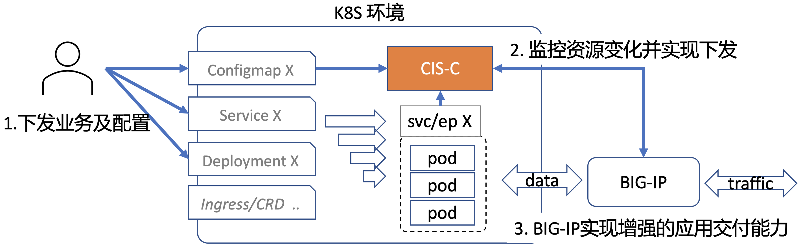

# 产品架构介绍

F5 CIS-C程序监控K8s中Configmap（包含AS3模板格式的交付配置）和Endpoints资源（包含客户应用服务信息），将其转换并下发为BIG-IP上的应用交付能力。之后，BIG-IP作为客户的应用服务入口，提供L4-L7的业务及流量的管控。

工作模型如下图所示：

所采用的技术栈包括：

   <!-- 将as3解析为符合以上格式的结构体是CIS-C实现下发的关键、基础。
   
   **运行cis-c-tool程序的根本目的，就是将BIG-IP上现有的资源信息组织起来（JSON）以internal Data Group的形式告知CIS-C程序。**
   
   **只有这样，CIS-C才能继续对资源进行Create Update Delete操作。**

4. 启动CIS-C程序，完成迁移。

   CIS-C启动后会首先加载interval Data Group中以`f5-kic_`开头的数据，将其作为已下发资源状态。有了这份信息，CIS-C可以：

   * 避免CIS-C重启后所有资源重新下发，这是因为internal Data Group信息可以作为上次下发的fingerprint，CIS-C每次下发前均会对比是否有变化。

   * 在其他下发程序下发基础上继续增量更新。虽然CIS-C并不能知道之前下发程序（如CIS）是如何下发的，但通过cis-c-tool可以知道下发程序操作后BIG-IP上的资源状态。在此状态上，CIS-C便可以知道各种资源的关联关系（例如virtual-pool-member关联关系），就可以继续CRUD了。 -->
