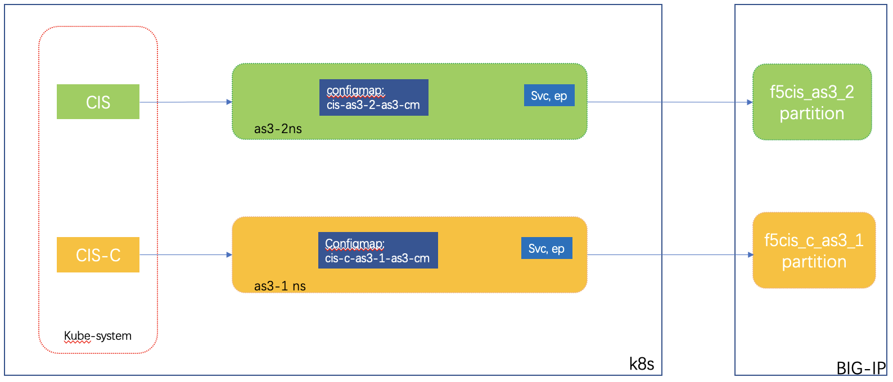

## 什么情形下会考虑CIS与CIS-C的混合部署

* 从CIS向CIS-C迁移的过渡阶段
* 需要继续使用k8s Ingress资源、CIS CRD资源、以及早期的cccl模型下的Configmap资源来进行业务发布，但同时又希望对AS3 Configmap发布方式具有更高发布性能。可使用CIS继续监听Ingress、CRD等资源，对于使用AS3语法的Configmap资源则采用CIS-C来发布
* 在架构设计上，需要同时支持Ingress，CRD，AS3 Configmap这三种资源模式的


## 混合部署需要考虑的问题

* 不同的控制器不应同时监控相同的k8s资源，应采用`--namespace`、`--namespace-label`[启动参数](/Architecture/parameters)对监控的资源进行隔离

* 不同的控制器下发的配置对象应分别对应在F5 BIG-IP的不同partition分区内，或对应到不同的F5 BIG-IP上

* 在Overlay CNI环境下，需要考虑不同控制器写入的静态ARP、FDB条目是否存在冲突：

  * FDB: CIS-C会检测F5上的关于node FDB条目是否存在，因此不会发生问题。
  * ARP: 对于pod相关的静态ARP，CIS采用覆盖性写入的方式，即CIS周期性刷新所有ARP条目，因此CIS写入的partition分区不能与CIS-C相同。
  
    目前，CIS-C写入的是F5 BIG-IP的`/cis-c-tenant`partition(> 2.9.1-20220831)，而CIS默认写入`/Common` partition下。新版本CIS-C会兼容并处理老版本（CIS-C <= 2.9.1-20220831）已经下发到Common下的ARPs条目。
    
  > 注意：可以通过以下方法修改CIS ARP写入partition，默认情况下并不需要：
  CIS 启动时，可以通过`--flannel-name`设置tunnel。通过修改此参数值，修改默认partition，例如将`--flannel-name=/Common/flannel_vxlan`修改为`--flannel-name=/k8s/flannel_vxlan`，则相应ARP条目会写入k8s partition下。这里的k8s是F5上一个已经存在的分区。但此操作需要考虑已下发的ARP条目该如何处理。

* 非Overlay CNI环境无考虑上述静态ARP问题

## 案例1：Hub模式下混合部署

### 结构透视图

在本示例中，CIS控制器监控`f5cis` namespace内的AS3发布资源，让CIS-C监控`cis-c-hub`下的AS3发布资源。结构图如下：


### Configmap Yaml示例

#### f5cis-hub-as3-cm yaml

```yaml
kind: ConfigMap
apiVersion: v1
metadata:
  name: f5cis-hub-as3-cm
  namespace: f5cis
  labels:
    f5type: virtual-server
    as3: "true"
data:
  template: |
    {
        "class": "AS3",
        "declaration": {
            "class": "ADC",
            "schemaVersion": "3.18.0",
            "id": "f5cis-as3-nginxdemo-dfdsf",
            "label": "Sample 1",
            "updateMode": "selective",
            "remark": "Simple HTTP application with RR pool",
            "f5cis_as3_2": {
                "class": "Tenant",
                    "nginxdemo_as3_2": {
                    "class": "Application",
                    "template": "generic",
                    "ingress_nginxdemo1": {
                        "class": "Service_HTTP",
                        "virtualAddresses": [
                            "172.16.100.145"
                        ],
                        "remark":"ingress: nginxdemo1",
                        "virtualPort": 80,
                        "pool": "nginxdemo_pool_as3_2"
                    },
                    "nginxdemo_pool_as3_2": {
                        "class": "Pool",
                        "monitors": [
                            "http"
                        ],
                        "members": [
                            {
                                "servicePort": 80,
                                "serverAddresses": [ ]
                            }
                        ]
                    }
                }
            }
        }
    }
```


#### cis-c-hub-as3  Yaml

```yaml
kind: ConfigMap
apiVersion: v1
metadata:
  name: cis-c-hub-as3-cm
  namespace: cis-c-hub
  labels:
    f5type: virtual-server
    as3: "true"
data:
  template: |
    {
        "class": "AS3",
        "declaration": {
            "class": "ADC",
            "schemaVersion": "3.18.0",
            "id": "f5cis-as3-nginxdemo-dfdsf",
            "label": "Sample 1",
            "updateMode": "selective",
            "remark": "Simple HTTP application with RR pool",
            "f5cis_c_as3_1": {
                "class": "Tenant",
                    "nginxdemo_as3_1": {
                    "class": "Application",
                    "template": "generic",
                    "ingress_nginxdemo1": {
                        "class": "Service_HTTP",
                        "virtualAddresses": [
                            "172.16.100.149"
                        ],
                        "remark":"ingress: nginxdemo1",
                        "virtualPort": 80,
                        "pool": "nginxdemo_pool_as3_1"
                    },
                    "nginxdemo_pool_as3_1": {
                        "class": "Pool",
                        "monitors": [
                            "http"
                        ],
                        "members": [
                            {
                                "servicePort": 80,
                                "serverAddresses": [ ]
                            }
                        ]
                    }
                }
            }
        }
    }
```


#### F5 BIGIP-IP配置效果


### 控制器启动参数示例

#### CIS控制器启动参数

```shell
      containers:
      - args:
        - --bigip-username=$(BIGIP_USERNAME)
        - --bigip-password=$(BIGIP_PASSWORD)
        - --bigip-url=172.16.20.205
        - --bigip-partition=k8s
        - --verify-interval=5
        - --node-poll-interval=5
        - --pool-member-type=cluster
        - --default-ingress-ip=172.16.100.196
        - --namespace=f5cis
        - --log-as3-response
        - --ingress-class=f5
        - --hubmode=true
        - --disable-teems=true
        - --insecure=true
        - --log-level=INFO
        - --http-listen-address=0.0.0.0:9113
        - --flannel-name=/k8s/flannel_vxlan
```


#### CIS-C控制器启动参数

````shell
      containers:
      - args:
        - --bigip-username=$(BIGIP_USERNAME)
        - --bigip-password=$(BIGIP_PASSWORD)
        - --bigip-url=https://172.16.20.205
        - --log-level=debug
        - --flannel-name=flannel_vxlan
        - --namespace=cis-c-hub
        - --hub-mode=true
        - --ignore-service-port
````


## 非Hub模式混合部署

### 结构透视图

在本示例中，CIS控制器监控`as3-2` namespace内的AS3发布资源，让CIS-C监控`as3-1`下的AS3发布资源。结构图如下：



### Confgimap Yaml示例

#### cis-as3-2-as3-cm 示例

```yaml
kind: ConfigMap
apiVersion: v1
metadata:
  name: cis-as3-2-as3-cm
  namespace: as3-2
  labels:
    f5type: virtual-server
    as3: "true"
data:
  template: |
    {
        "class": "AS3",
        "declaration": {
            "class": "ADC",
            "schemaVersion": "3.18.0",
            "id": "f5cis-as3-nginxdemo-dfdsf",
            "label": "Sample 1",
            "updateMode": "selective",
            "remark": "Simple HTTP application with RR pool",
            "f5cis_as3_2": {
                "class": "Tenant",
                    "nginxdemo_as3_2": {
                    "class": "Application",
                    "template": "generic",
                    "ingress_nginxdemo1": {
                        "class": "Service_HTTP",
                        "virtualAddresses": [
                            "172.16.100.145"
                        ],
                        "remark":"ingress: nginxdemo1",
                        "virtualPort": 80,
                        "pool": "nginxdemo_pool_as3_2"
                    },
                    "nginxdemo_pool_as3_2": {
                        "class": "Pool",
                        "monitors": [
                            "http"
                        ],
                        "members": [
                            {
                                "servicePort": 80,
                                "serverAddresses": [ ]
                            }
                        ]
                    }
                }
            }
        }
    }
```


#### cis-c-as3-1-as3-cm示例

```yaml
kind: ConfigMap
apiVersion: v1
metadata:
  name: cis-c-as3-1-as3-cm
  namespace: as3-1
  labels:
    f5type: virtual-server
    as3: "true"
data:
  template: |
    {
        "class": "AS3",
        "declaration": {
            "class": "ADC",
            "schemaVersion": "3.18.0",
            "id": "f5cis-as3-nginxdemo-as3-1",
            "label": "Sample 1",
            "updateMode": "selective",
            "remark": "Simple HTTP application with RR pool",
            "f5cis_c_as3_1": {
                "class": "Tenant",
                    "nginxdemo_as3_1": {
                    "class": "Application",
                    "template": "generic",
                    "ingress_nginxdemo1": {
                        "class": "Service_HTTP",
                        "virtualAddresses": [
                            "172.16.100.149"
                        ],
                        "remark":"ingress: nginxdemo1",
                        "virtualPort": 80,
                        "pool": "nginxdemo_pool_as3_1"
                    },
                    "nginxdemo_pool_as3_1": {
                        "class": "Pool",
                        "monitors": [
                            "http"
                        ],
                        "members": [
                            {
                                "servicePort": 80,
                                "serverAddresses": [ ]
                            }
                        ]
                    }
                }
            }
        }
    }
```


#### F5 BIGIP-IP配置效果:

相对于以上Hub模式下的配置，Configmap里对应的F5 partiton（tenant）并未发生变化，对象命名也均未发生变化，因此在BIG-IP的最终效果与上图一致。


### 控制器启动参数示例

#### CIS控制器启动参数

```shell
      containers:
      - args:
        - --bigip-username=$(BIGIP_USERNAME)
        - --bigip-password=$(BIGIP_PASSWORD)
        - --bigip-url=172.16.20.205
        - --bigip-partition=k8s
        - --verify-interval=5
        - --node-poll-interval=5
        - --pool-member-type=cluster
        - --default-ingress-ip=172.16.100.196
        - --namespace=as3-2 <<<<< as3-2 namespace
        - --hubmode=false <<<<<<非hub模式
        - --log-as3-response
        - --ingress-class=f5
        - --disable-teems=true
        - --insecure=true
        - --log-level=INFO
        - --http-listen-address=0.0.0.0:9113
        - --flannel-name=/k8s/flannel_vxlan
```


#### CIS-C控制器启动参数

```shell
      containers:
      - args:
        - --bigip-username=$(BIGIP_USERNAME)
        - --bigip-password=$(BIGIP_PASSWORD)
        - --bigip-url=https://172.16.20.205
        - --log-level=debug
        - --flannel-name=flannel_vxlan
        - --namespace=as3-1 <<<<< as3-1 namespace
        - --hub-mode=false  <<<<< 非hub模式
        - --ignore-service-port
```

