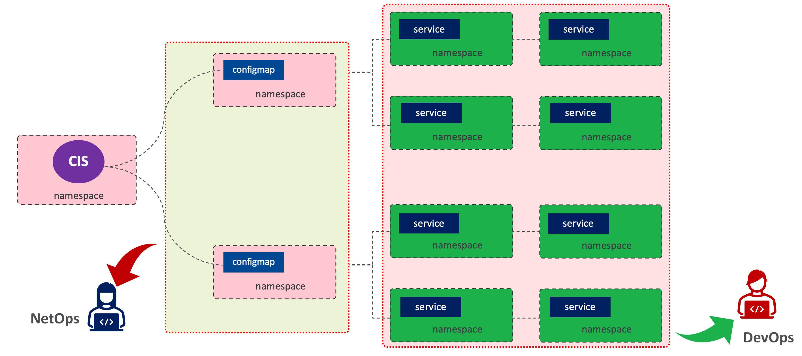

## 场景描述

### 什么是 hub 模式

hub 模式既控制平面集中式管理，hub 模式是一种很常见的应用场景，这种模式下，配置管理与服务管理可以相互独立，由不同运维人员在不同的namespace中处理。

如上图所示，DevOps 负责在绿色背景的 Namspace 中开发部署应用，NetOps 负责在红色背景的 Namspace 中将 DevOps 开发的应用发布出去。

hub 模式适用于对容器应用发布有几种管控诉求的场景，集合 Kubernetes 的 RBAC 等功能可以指定清晰的安全边界，使得容器应用开发者和容器应用的发布者各司其职。hub 模式适合大中型企业或组织，多部门参与的容器业务建设，在这种场景下 hub 模式可带来优化不同组织部门，现代化已有流程和规范的好的。

### CIS-C 部署中启用 hub 模式

hub 模式在 CIS-C 的部署中通过 `--hub-mode` 参数启动，hub 模式需要通过 `--namespace` 或 `--namespace-label` 参数配置使用，`--namespace` 或 `--namespace-label` 通过明细声明或标签指定控制平面集中式管理的 Namspace。

~~~
          args: [
            "--bigip-username=$(BIGIP_USERNAME)",
            "--bigip-password=$(BIGIP_PASSWORD)",
            "--log-level=info",
            "--bigip-url=https://192.168.200.204",
            "--hub-mode=true",
            "--namespace=f5-hub-1",
            "--namespace=f5-hub-2"
            ]
~~~

* `--hub-mode` - 指定是否开启 hub 模式，参数值为 `true` 表示开启 hub 模式
* `--namespace` - hub 模式下 `--namespace` 定义了控制平面集中式管理的 Namspace 的名称，资源跨ns可关联 

NOTE: hub-mode 用于指定是否可以跨ns做cm与svc的关联，namespace namespace-label 用于圈定控制器监听资源范围，准确说是 hub-mode为true时表示namespace namespace-label指定的ns， configmap资源被监控，其他ns， svc ep被监控，hub-mode 为false时表示所有资源的范围。如果namespace namespace-label参数未指定，则hub-mode 为true时 所有资源都被监控，资源跨ns可关联。hub-mode为false时，所有资源都被监控，资源跨ns不可关联。

### Hub 模式部署示例

#### 应用部署: 5 个容器应用分别位于 5 个 Namespace:

~~~
apiVersion: v1
kind: Namespace
metadata:
  name: cistest1
  labels:
    cis_scanner: cistest
---
apiVersion: apps/v1
kind: Deployment
metadata:
  labels:
    app: app-1
  name: app-1
  namespace: cistest1
spec:
  replicas: 1
  selector:
    matchLabels:
      app: app-1
  template:
    metadata:
      labels:
        app: app-1
    spec:
      containers:
      - image: cloudadc/cafe:1.0
        name: backend
        ports:
        - containerPort: 8080
---
apiVersion: v1
kind: Service
metadata:
  labels:
    app: app-1
    cis.f5.com/as3-tenant: cistest1
    cis.f5.com/as3-app: app-1
    cis.f5.com/as3-pool: app-1_app_svc_pool
  name: app-svc-1
  namespace: cistest1
spec:
  ports:
  - port: 80
    protocol: TCP
    targetPort: 8080
  selector:
    app: app-1
  sessionAffinity: None
  type: ClusterIP
---
apiVersion: v1
kind: Namespace
metadata:
  name: cistest2
  labels:
    cis_scanner: cistest
---
apiVersion: apps/v1
kind: Deployment
metadata:
  labels:
    app: app-1
  name: app-1
  namespace: cistest2
spec:
  replicas: 1
  selector:
    matchLabels:
      app: app-1
  template:
    metadata:
      labels:
        app: app-1
    spec:
      containers:
      - image: cloudadc/cafe:1.0
        name: backend
        ports:
        - containerPort: 8080
---
apiVersion: v1
kind: Service
metadata:
  labels:
    app: app-1
    cis.f5.com/as3-tenant: cistest2
    cis.f5.com/as3-app: app-1
    cis.f5.com/as3-pool: app-1_app_svc_pool
  name: app-svc-1
  namespace: cistest2
spec:
  ports:
  - port: 80
    protocol: TCP
    targetPort: 8080
  selector:
    app: app-1
  sessionAffinity: None
  type: ClusterIP
---
apiVersion: v1
kind: Namespace
metadata:
  name: cistest3
  labels:
    cis_scanner: cistest
---
apiVersion: apps/v1
kind: Deployment
metadata:
  labels:
    app: app-1
  name: app-1
  namespace: cistest3
spec:
  replicas: 1
  selector:
    matchLabels:
      app: app-1
  template:
    metadata:
      labels:
        app: app-1
    spec:
      containers:
      - image: cloudadc/cafe:1.0
        name: backend
        ports:
        - containerPort: 8080
---
apiVersion: v1
kind: Service
metadata:
  labels:
    app: app-1
    cis.f5.com/as3-tenant: cistest3
    cis.f5.com/as3-app: app-1
    cis.f5.com/as3-pool: app-1_app_svc_pool
  name: app-svc-1
  namespace: cistest3
spec:
  ports:
  - port: 80
    protocol: TCP
    targetPort: 8080
  selector:
    app: app-1
  sessionAffinity: None
  type: ClusterIP
---
apiVersion: v1
kind: Namespace
metadata:
  name: cistest4
  labels:
    cis_scanner: cistest
---
apiVersion: apps/v1
kind: Deployment
metadata:
  labels:
    app: app-1
  name: app-1
  namespace: cistest4
spec:
  replicas: 1
  selector:
    matchLabels:
      app: app-1
  template:
    metadata:
      labels:
        app: app-1
    spec:
      containers:
      - image: cloudadc/cafe:1.0
        name: backend
        ports:
        - containerPort: 8080
---
apiVersion: v1
kind: Service
metadata:
  labels:
    app: app-1
    cis.f5.com/as3-tenant: cistest4
    cis.f5.com/as3-app: app-1
    cis.f5.com/as3-pool: app-1_app_svc_pool
  name: app-svc-1
  namespace: cistest4
spec:
  ports:
  - port: 80
    protocol: TCP
    targetPort: 8080
  selector:
    app: app-1
  sessionAffinity: None
  type: ClusterIP
---
apiVersion: v1
kind: Namespace
metadata:
  name: cistest5
  labels:
    cis_scanner: cistest
---
apiVersion: apps/v1
kind: Deployment
metadata:
  labels:
    app: app-1
  name: app-1
  namespace: cistest5
spec:
  replicas: 1
  selector:
    matchLabels:
      app: app-1
  template:
    metadata:
      labels:
        app: app-1
    spec:
      containers:
      - image: cloudadc/cafe:1.0
        name: backend
        ports:
        - containerPort: 8080
---
apiVersion: v1
kind: Service
metadata:
  labels:
    app: app-1
    cis.f5.com/as3-tenant: cistest5
    cis.f5.com/as3-app: app-1
    cis.f5.com/as3-pool: app-1_app_svc_pool
  name: app-svc-1
  namespace: cistest5
spec:
  ports:
  - port: 80
    protocol: TCP
    targetPort: 8080
  selector:
    app: app-1
  sessionAffinity: None
  type: ClusterIP
---
~~~

#### 应用发布: 两个 configmap 发布 5 个服务

configmap `cm-hub-1` 位于 `f5-hub-1`，发布 `cistest1` 、`cistest2` 和 `cistest5` 中的应用服务

~~~
kind: ConfigMap
apiVersion: v1
metadata:
  name: cm-hub-1
  namespace: f5-hub-1
  labels:
    f5type: virtual-server
    as3: "true"
data:
  template: |
    {
      "class": "AS3",
      "action": "deploy",
      "persist": true,
      "declaration": {
        "class": "ADC",
        "schemaVersion": "3.36.0",
        "id": "f5-hub01",
        "cistest1": {
          "class": "Tenant",
          "app-1": {
            "class": "Application",
            "template": "generic",
            "app_svc_vs": {
              "class": "Service_HTTP",
              "persistenceMethods": [ "cookie" ],
              "virtualAddresses": [
                "10.1.10.1"
              ],
              "snat": "self",
              "virtualPort": 80,
              "pool": "app-1_app_svc_pool"
            },
            "app-1_app_svc_pool": {
              "class": "Pool",
              "monitors": [
                "tcp"
              ],
              "loadBalancingMode": "least-connections-member",
              "members": [
              {
                "servicePort": 8088,
                "serverAddresses": []
              }
              ]
            }
          }
        },
        "cistest2": {
          "class": "Tenant",
          "app-1": {
            "class": "Application",
            "template": "generic",
            "app_svc_vs": {
              "class": "Service_HTTP",
              "persistenceMethods": [ "cookie" ],
              "virtualAddresses": [
                "10.1.10.2"
              ],
              "snat": "self",
              "virtualPort": 80,
              "pool": "app-1_app_svc_pool"
            },
            "app-1_app_svc_pool": {
              "class": "Pool",
              "monitors": [
                "tcp"
              ],
              "loadBalancingMode": "least-connections-member",
              "members": [
              {
                "servicePort": 8080,
                "serverAddresses": []
              }
              ]
            }
          }
        },
        "cistest5": {
          "class": "Tenant",
          "app-1": {
            "class": "Application",
            "template": "generic",
            "app_svc_vs": {
              "class": "Service_HTTP",
              "persistenceMethods": [ "cookie" ],
              "virtualAddresses": [
                "10.1.10.5"
              ],
              "snat": "self",
              "virtualPort": 80,
              "pool": "app-1_app_svc_pool"
            },
            "app-1_app_svc_pool": {
              "class": "Pool",
              "monitors": [
                "tcp"
              ],
              "loadBalancingMode": "least-connections-member",
              "members": [
              {
                "servicePort": 8080,
                "serverAddresses": []
              }
              ]
            }
          }
        }
      }
    }
~~~

configmap `cm-hub-2` 位于 `f5-hub-2`，发布 `cistest3` 和 `cistest4` 中的应用服务：

~~~
kind: ConfigMap
apiVersion: v1
metadata:
  name: cm-hub-2
  namespace: f5-hub-2
  labels:
    f5type: virtual-server
    as3: "true"
data:
  template: |
    {
      "class": "AS3",
      "action": "deploy",
      "persist": true,
      "declaration": {
        "class": "ADC",
        "schemaVersion": "3.36.0",
        "id": "f5-hub02",
        "cistest3": {
          "class": "Tenant",
          "app-1": {
            "class": "Application",
            "template": "generic",
            "app_svc_vs": {
              "class": "Service_HTTP",
              "persistenceMethods": [ "cookie" ],
              "virtualAddresses": [
                "10.1.10.3"
              ],
              "snat": "self",
              "virtualPort": 80,
              "serviceDownImmediateAction": "reset",
              "pool": "app-1_app_svc_pool"
            },
            "app-1_app_svc_pool": {
              "class": "Pool",
              "monitors": [
                "tcp"
              ],
              "loadBalancingMode": "least-connections-member",
              "members": [
              {
                "servicePort": 80,
                "serverAddresses": []
              }
              ]
            }
          }
        },
        "cistest4": {
          "class": "Tenant",
          "app-1": {
            "class": "Application",
            "template": "generic",
            "app_svc_vs": {
              "class": "Service_HTTP",
              "persistenceMethods": [ "cookie" ],
              "virtualAddresses": [
                "10.1.10.4"
              ],
              "snat": "self",
              "virtualPort": 80,
              "pool": "app-1_app_svc_pool"
            },
            "app-1_app_svc_pool": {
              "class": "Pool",
              "monitors": [
                "tcp"
              ],
              "loadBalancingMode": "least-connections-member",
              "members": [
              {
                "servicePort": 80,
                "serverAddresses": []
              }
              ]
            }
          }
        }
      }
    }
~~~

#### 发布验证：在 BIG-IP 上命令行查看 5 个服务发布情况

~~~
$ for i in {1..5}; do tmsh list ltm virtual /cistest$i/app-1/app_svc_vs one-line ; done
ltm virtual /cistest1/app-1/app_svc_vs { creation-time 2022-07-24:22:21:38 description app-1 destination /cistest1/10.1.10.1:http ip-protocol tcp last-modified-time 2022-07-24:22:21:38 mask 255.255.255.255 partition cistest1 persist { cookie { default yes } } pool /cistest1/app-1/app-1_app_svc_pool profiles { f5-tcp-progressive { } http { } } serverssl-use-sni disabled source 0.0.0.0/0 source-address-translation { pool /cistest1/app-1/app_svc_vs-self type snat } translate-address enabled translate-port enabled vs-index 2935 }
ltm virtual /cistest2/app-1/app_svc_vs { creation-time 2022-07-24:22:21:04 description app-1 destination /cistest2/10.1.10.2:http ip-protocol tcp last-modified-time 2022-07-24:22:21:04 mask 255.255.255.255 partition cistest2 persist { cookie { default yes } } pool /cistest2/app-1/app-1_app_svc_pool profiles { f5-tcp-progressive { } http { } } serverssl-use-sni disabled source 0.0.0.0/0 source-address-translation { pool /cistest2/app-1/app_svc_vs-self type snat } translate-address enabled translate-port enabled vs-index 2933 }
ltm virtual /cistest3/app-1/app_svc_vs { creation-time 2022-07-24:22:22:22 description app-1 destination /cistest3/10.1.10.3:http ip-protocol tcp last-modified-time 2022-07-24:22:22:22 mask 255.255.255.255 partition cistest3 persist { cookie { default yes } } pool /cistest3/app-1/app-1_app_svc_pool profiles { f5-tcp-progressive { } http { } } serverssl-use-sni disabled service-down-immediate-action reset source 0.0.0.0/0 source-address-translation { pool /cistest3/app-1/app_svc_vs-self type snat } translate-address enabled translate-port enabled vs-index 2937 }
ltm virtual /cistest4/app-1/app_svc_vs { creation-time 2022-07-24:22:22:04 description app-1 destination /cistest4/10.1.10.4:http ip-protocol tcp last-modified-time 2022-07-24:22:22:04 mask 255.255.255.255 partition cistest4 persist { cookie { default yes } } pool /cistest4/app-1/app-1_app_svc_pool profiles { f5-tcp-progressive { } http { } } serverssl-use-sni disabled source 0.0.0.0/0 source-address-translation { pool /cistest4/app-1/app_svc_vs-self type snat } translate-address enabled translate-port enabled vs-index 2936 }
ltm virtual /cistest5/app-1/app_svc_vs { creation-time 2022-07-24:22:21:20 description app-1 destination /cistest5/10.1.10.5:http ip-protocol tcp last-modified-time 2022-07-24:22:21:20 mask 255.255.255.255 partition cistest5 persist { cookie { default yes } } pool /cistest5/app-1/app-1_app_svc_pool profiles { f5-tcp-progressive { } http { } } serverssl-use-sni disabled source 0.0.0.0/0 source-address-translation { pool /cistest5/app-1/app_svc_vs-self type snat } translate-address enabled translate-port enabled vs-index 2934 }
~~~
