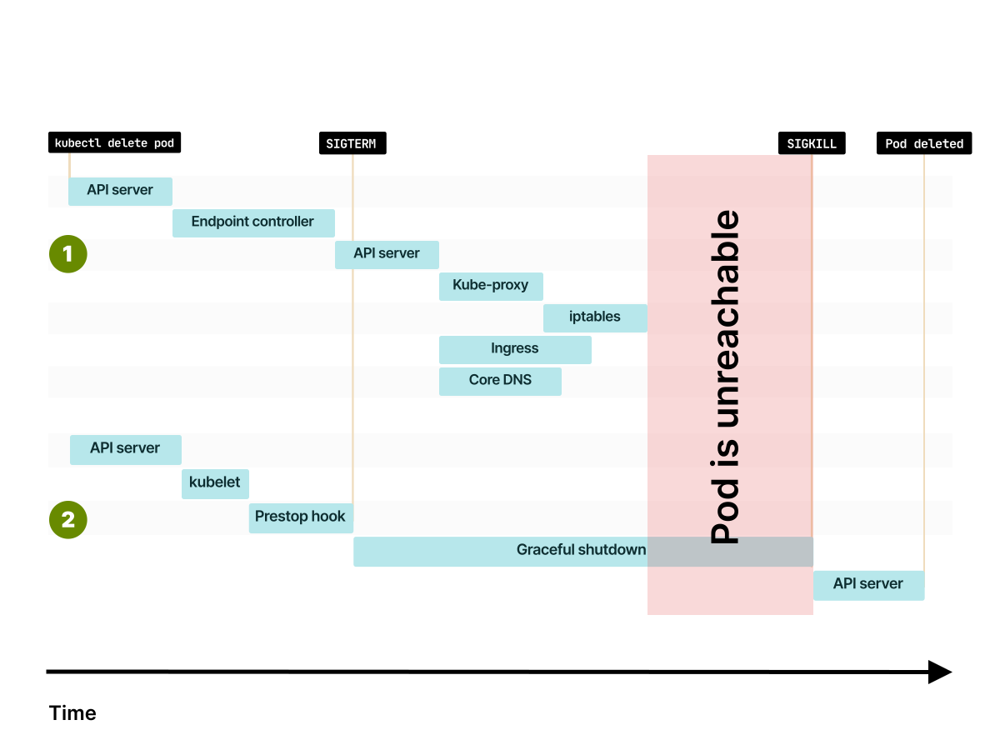
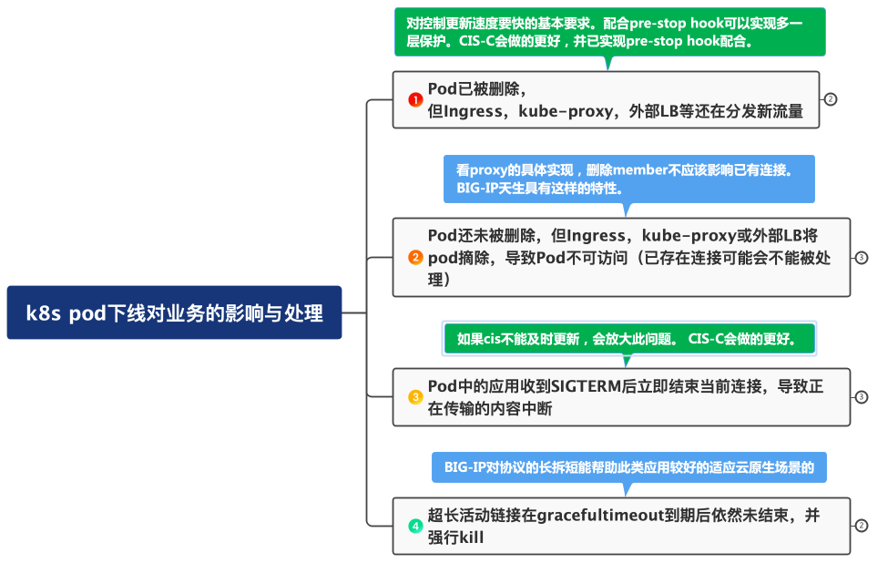

在kubernetes中下线或更新一个应用pod是一个需要仔细处理的事情，否则会容易导致应用的服务水平（SLA）下降。这是因为相对于传统的虚机或静态服务器部署的应用，k8s中应用pod极易发生删除、重建、重新部署等活动。在传统环境下短暂连接或请求的中断是可以被接受的，因为此类变化往往发生在特定的有限变更窗口，不会明显损害服务水平。然而，在k8s动态环境下，这类变化可能会发生在任何时刻，频率也会更高，这会放大短暂中断带来的影响，不断累加的结果就是服务水平的明显下降。

因此在k8s中，需要仔细分析和处理pod下线的行为与影响。可能导致的影响因素有：
* k8s中pod的删除处理机制
* k8s中相关Ingress、Kube-proxy、CoreDNS、CNI等组件涉及的删除处理机制
* 如有外部LB，外部LB对相关对象的删除处理机制

## Kubernetes内部对Pod下线的处理

在Kubernetes中，当一个pod下线时，会发生两个大的方面的并行处理：

1. endpoint controller以及Ingress、Kube-proxy等组件对待删除对象的处理。如果涉及外部LB，还设计外部LB所对应的控制器的处理。
2. kubelet对具体pod的销毁处理

这两个处理是完全并行和异步的，彼此并不会关注对方的状态与依赖。这就可能造成pod的实际删除早于或晚于Ingress、kube-proxy或外部LB控制器的处理。这些不同的行为会造成不同的结果，需要针对性的进行不同的处理。

关于k8s中对pod的处理流程与机制，可参考[此篇文章](https://learnk8s.io/graceful-shutdown)。这里引用其一张图示来直观的表现：

当执行诸如`kubectl delete pod`操作后，k8s的API server会捕捉相关信息，该消息会被endpoint controller以及kubelet两个组件关注，并分别产生各自的后续独立动作。Endpoint controller一旦发生了更新了EP list的事件后，kube-proxy、外部LB控制器、Ingress等组件都会捕捉到该事件，进而触发相关组件的各自动作。例如Ingress会更新相关数据面的配置，外部LB控制器（例如CIS-C)会触发更新BIG-IP中相关pool member，Kube-proxy等组件也会清理修改相关iptables等。 Kubelet组件则会在`prestop hook`得到响应之后发出`SIGTERM`型号，Pod中的容器应用则可能会响应SIGTERM开始终止进程与连接的操作。

## 对Pod下线的四种情况分析

整体来说，可以分为4个情况来分析。

### Pod已被删除，但Ingress、Kube-proxy、外部LB控制器等还在分发新的流量。

这种情形下，会导致新连接的失败。

解决问题的思路主要是尽可能的让Ingress、外部LB控制器等这些组件尽可能早的去删除相关pod对象，要比kubelet去实际删除pod要早。可以考虑在prestop hook阶段设置等待时间，让其它组件有足够的时间去处理。

**对于CIS-C来说，绝大部分情况下CIS-C摘除pool member的动作是早于kubelet执行删除的。对于万一出现CIS-C摘除pool member太迟的情况，可以在prestop hook阶段发送信号给CIS-C（[2.13.1-20230629](https://cis-c.f5se.io/Release-notes/#release-2131-20230629)之后版本已支持），接到信号后CIS-C对相关member（Pod IP）先先执行disable操作，等捕获到ep controller的删除事件后再执行删除操作（或以`terminationGracePeriodSeconds`所配置的时间作为最长等待时间，超时后直接删除)。**

### Pod还未被删除，但Ingress或外部LB控制器等组件已经移除相关Pod。

一般来说pod在Ingress或外部LB控制器之后被删除是期望的结果。已经建立的连接应该被继续处理。比如**BIG-IP虽然member已经被删除，但是已经建立的连接依然能被处理**。但仍然需了解当前所用的相关proxy产品的数据面是否具备对已删除member的已有连接的处理。

但在类如Etcd API异常等情况下，可能会导致k8s API响应慢或者相关组件的控制器处理慢，这就可能会导致Pod先被删除，这种就进入了情形1所描述的问题范畴。

### Pod中的应用收到SIGTERM信号后，立即结束当前连接。导致尚未完成的业务传输被终止。

一般来说，在kubernetes中运行的应用需要考虑遵从云原生应用开发12要素中的一个建议，即服务应执行Graceful shutdown操作。如果收到SIGTERM就开始终止连接，在k8s这种频繁pod变化的环境下，这种中断体验带来的影响会被放大，从而降低服务SLA。对于外部LB控制器来说，如果不能及时反映相关变化，就会导致继续分发相关新连接，从而放大问题。

因此需要尽量在kubelet发出SIGTERM信号之前就让该pod上的连接尽快处理完毕。因此就需要在SIGTERM信号发出之前前端的Ingress，外部LB提前停止分发新的连接，**例如CIS-C的高性能特性可以在BIG-IP上快速删除相关member，或在k8s API接口异常情况下能通过prestop hook发送信号提前disable/force offline相关member**。同时，在prestop hook阶段采用sleep方式等待一些时间也可以帮助减缓问题，利用这个sleep时间让应用将已有的连接处理完毕，以尽量达到在收到SIGTERM时候该pod已经没有连接了。

### 超长活动连接在`terminationGracePeriodSeconds`到期后依然未结束，被kubelet强行Kill。

尽管上述三种情况已经针对连接的graceful closing做了最大的优化处理，但针对超长时间的活动连接仍然是个问题。

对于这类超长连接，一方面前端LB对已有连接不能删除，另一方面就是通过设置很长的`terminationGracePeriodSeconds`等待其完成，并择机关闭。通过rolling update，确保新的版本已经产生并接管新连接，让已有连接慢慢结束。整体来说，这类长连接只能是尽量维持，到期如必须停止，可以考虑在固定的变更窗口人工处理，**或利用BIG-IP的空闲超时设置，如果连接在特定的空闲时间内没有再传输则由BIG-IP自动关闭连接**。如果传输的协议具有一定特征，如可能，**BIG-IP可以考虑利用MBLB或iRule将长连接拆为短连接处理**。

## 总结

以下一张图总结

