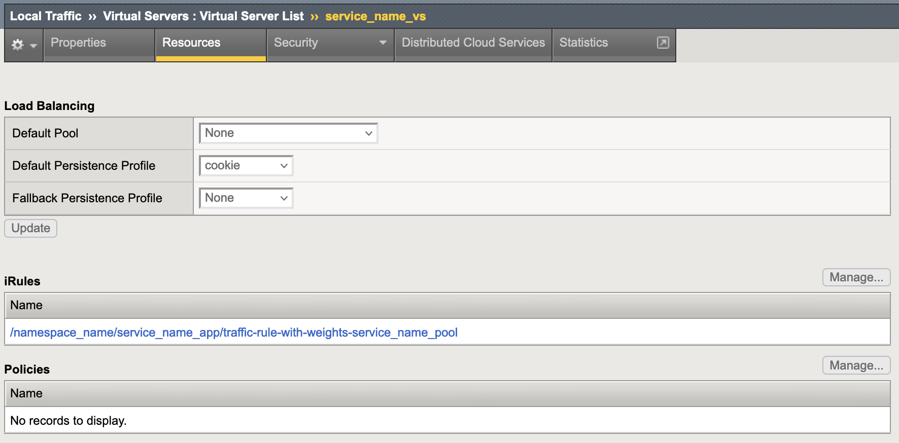
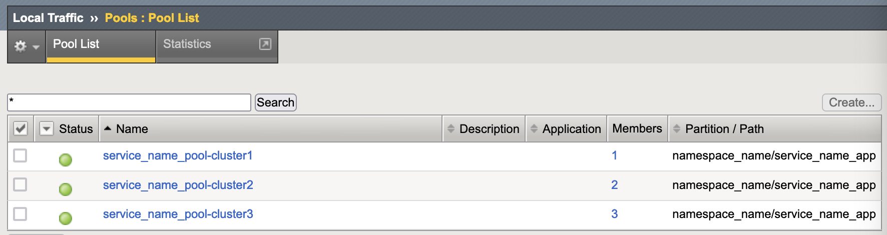

Kubernetes 从 1.8 版本起,单集群最多可支持5000个Node和15万个Pod，一般来说用户构建大规模的单集群存在较大的生产运行风险，很多情况下因为各种各样的原因例如访问安全性、资源隔离要求、运维成本等等，我们会更多可能会部署多个集群。

多个集群的部署方案具有很多好处：

* 高可用：在多个集群上部署应用，可以最大限度地减少集群故障带来的影响

* 避免厂商锁定：可以将应用负载分布在多个厂商的集群上并在有需要时直接迁移到其它厂商

* 故障隔离：拥有多个小集群可能比单个大集群更利于故障隔离


同时，鉴于BIG-IP的高性能吞吐能力，多个集群仍旧可以共享单个（组）BIG-IP设备，使其作为多个k8s集群的统一入口。

在这种需求背景下，CIS-C 从2.15版本引入多集群处理能力（Multi-Cluster）。用户可以

* 在某一个集群中部署CIS-C监听并下发指定**多个集群**的资源变化（`--extended-clusters`）。

* 在多个集群中分别部署CIS-C，这些CIS-C组成HA关系，确保在某个集群出现异常时已经可以下发业务和应用（`--leader-election`）。

总而言之，**CIS-C 的多集群支持允许用户使用单个（组）BIG-IP 设备映射和转发多个Kubernetes集群中的多个应用的流量。部署在不同的 Kubernetes 集群中的应用由单个BIG-IP设备统一发布。CIS-C可以部署为单一运行模式，也可以部署为HA模式**。

## 多集群模式的CIS-C配置方式

单集群模式下，CIS-C Deployment被部署在k8s集群中，以InCluster模式运行，监听本集群内的资源变化。

多集群模式下，为了让CIS-C监听指定其他集群的资源，需要在CIS-C启动参数中添加`--extended-clusters`参数，参数的值为 `<secret namespace>/<secret name>`，例如：


```shell
          args: [
            # "--kube-config=/path/to/kubeconfig/for/out-of-cluster-mode"
            "--bigip-username=$(BIGIP_USERNAME)",
            "--bigip-password=$(BIGIP_PASSWORD)",
            "--bigip-url=$(BIGIP_URL)",
            "--extended-clusters=kube-system/extended-clusters", # deploy multi cluster mode
            "--log-level=debug"
          ]
```

在 Secret `kube-system/extended-clusters` 保存了其他指定集群的kubeConfig内容，在CIS-C启动时加载该Secret，并根据Secret中的集群信息创建指向各个集群的连接客户端：

```yaml
---

apiVersion: v1
kind: Secret
metadata:
  name: extended-clusters
  namespace: kube-system
type: Opaque
data:
  cluster1: $(cat ../cluster1-kubeconfig | base64 -w 0)
  cluster2: ...
  cluster3: ...
  ...
```

其中：

* 各个集群`cluster1 cluster2 cluster3`的命名可以根据实际需要自行命名，相互之间不重复即可。在后文中，我们称集群名称为“键”，冒号后边部分为“值”，以便描述。
* 集群命名即“键”会关系到各个集群中部署的应用在BIG-IP上下发后的名称后缀，例如，部署在cluster2中的serviceA对应在BIG-IP上的pool名称会类似于serviceA-cluster2，所以Secret中命名一旦确认后不建议修改，如果被修改，CIS-C重启后会重新下发相关集群的应用，赋予新的集群名称后缀。
* `$(cat ../cluster1-kubeconfig | base64 -w 0)` 即“值”部分为cluster1 的kubeconfig内容，需要在shell中执行此部分命令得到base64编码内容后填入到此处。
* 当“值”为空字符串时，CIS-C 以InCluster模式的方式监听本地集群资源变化；否则，CIS-C以OutOfCluster的模式监听资源变化。所以，一般情况下，各个“值”中，最多有一个为空字符串，用于涵盖本集群中必要资源的监听，其他几个“值”不能为空，且各不相同，指向不同的集群。如果有两个“值”相同（包括两个空字符串“值”），CIS-C则重复监听指向的集群的资源，重复的将他们下发到BIG-IP，以不同的集群名称作为后缀。
* 多集群模式下，为了监控本集群中资源变化，该Secret**必须**包含CIS-C所在集群的“键”和“值”。多集群模式下，`--kube-config`参数依旧指向本集群（不指明时，CIS-C 以InCluster模式运行），但仅监听Configmap资源变化。即，CIS-C会 1）通过 `--kube-config`参数监听本集群configmap 的资源变化，2）通过 `--extended-clusters`监听任意集群（可以包含本集群）其他资源（例如Endpoints，Service，Namespace、Node等等）必要资源变化。

## 多集群中BIG-IP上的资源组织方式

相比于单集群模式，多集群模式下，来自不同集群的应用及业务下发到BIG-IP后，资源的关联关系发生变化，来自不同集群的应用通过irule和下发的业务(configmap)关联，如下图所示：

**Virtual:**



virtual中绑定了irule，而没有绑定任何Default Pool.

**Pools:**



来自不同的集群的应用（Service+Deployment）具备相同的三标签（`cis.f5.com/as3-tenant`、`cis.f5.com/as3-app`、`cis.f5.com/as3-pool`），所以他们所处的partition、subfolder均相同，不同的是他们附加集群名称的后缀。


## 多集群下的入口流量分配

通过在Service定义中添加`cis.f5.com/multi-cluster.pool-weight`标签，我们可以实现对多集群模式下不同集群中同一应用按比例分配流量。

在上一节中，cluster1 cluster2 cluster3的比重分别为10 20 30，从iRule实现看，三个集群的应用流量为： 1/6, 1/3, 1/2。

标签配置示例如下：

```yaml
---

apiVersion: v1
kind: Service
metadata:
  name: rest-service-http
  namespace: default
  labels:
    # f5kic-resource: "true"
    cis.f5.com/as3-tenant: namespace_name
    cis.f5.com/as3-app: service_name_app
    cis.f5.com/as3-pool: service_name_pool
    cis.f5.com/multi-cluster.pool-weight: "30"
spec:
  ports:
  - port: 8080
    protocol: TCP
    targetPort: 80
  selector:
    run: rest-service-http
  sessionAffinity: None
  type: ClusterIP
```

`cis.f5.com/multi-cluster.pool-weight`的值为默认数值为1，取值范围是正整数，但不宜过大，否则会降低iRule的执行效率。正常情况下，该控制策略可以满足绝大多数的流量分配比例要求。

## 多集群模式下CIS-C的HA

多集群模式下，为了避免集群本身异常带来的下发中断，比如整个集群因为运维不当或者资源超载导致的崩溃，CIS-C可以部署为HA模式。该模式下，涉及资源下发的每个集群中分别部署CIS-C实例，他们之间构成Active-Standby的HA模式。

配置方法为，在CIS-C启动参数中添加`--leader-election`。

**注意**：添加了该参数的CIS-C实例和未添加该参数的CIS-C实例不可同时运行，否则两个实例会同时工作，重复监控资源变化，引发下发异常。

### CIS-C HA工作机制

在多集群CIS-C HA实现方案中，我们实现了基于BIG-IP设备的Leader锁竞选机制，具体来说:

* CIS-C HA的多个实例通过iControlRest去尝试锁定和更新BIG-IP上名为`f5-cis-c-leader-election-lock`的`data-group/internal`资源。

* 一旦某一个CIS-C锁定该资源，它就是leader，该CIS-C实例处于Active 状态，负责各个集群下的资源监听和下发任务，而另一个CIS-C处于Standby的状态，周期性关注锁的状态，当Active的CIS-C退出（比如A集群崩溃，或A集群CIS-C被删掉），而Standby状态变为Active，开始接管各集群的资源监听和下发。

* 竞选锁持有周期为30秒，持有者刷新锁间隔为15秒。即，当Active的CIS-C实例退出或者下发中断，最迟30秒钟Standby的CIS-C接管监控和下发任务。

通过以下iControlRest命令，我们可以获取资源锁的内容，它记录了必要的竞争信息：

```shell
{
  "holderIdentity": "f5-kic-f4f031f5-3586-4549-800e-b351d69d6820",
  "leaseDurationSeconds": 30,
  "acquireTime": "2024-01-12T08:51:39Z",
  "renewTime": "2024-01-12T15:29:09Z",
  "leaderTransitions": 55
}
```

其中，

* `holderIdentity`为持有者ID，ID组成为f5-kic-前缀和CIS-C实例启动时的随机UUID。
* `leaseDurationSeconds`为竞选锁持有周期，也称租期。
* `acquireTime` 为当前持有者成功获取该锁的时间。
* `renewTime`为最后一次更新锁时间。
* `leaderTransitions`为锁变更持有者的次数。


## 多集群模式下的资源监控策略


CIS-C Active实例不但监控自身所在集群的资源变化，还会监控其他指定集群的资源类型。指定集群通过 `--extended-clusters` 参数实现。

**多集群环境下，用户的业务下发（Configmap）仅来自CIS-C所在集群，而其它资源类型，例如Endpoints，Service，Node等来自于各个集群**， 即：

Active CIS-C会监控两部分：

* a. CIS-C所在集群的Configmap资源，所在集群由`--kube-config`所指向。
* b. 所有集群的Endpoints，Service，Node，由`--extended-clusters`指向。

当主备发生切换时，b部分的监控没有变化，依旧是所有集群的这些资源，但Configmap的监控切换为新的Active CIS-C实例所在的集群。

**用户需要负责两个集群的Configmap 互为备份，以确保当一个集群发生异常时，业务依旧存在于另外集群，继续由新的CIS-C下发。**

当CIS-C主备发生切换时，新的主CIS-C会监控自身所在集群的Configmap资源变化，因为这个资源之前是备份，CIS-C会按照本地的configmap实现业务下发。 

如果两个集群的configmap不一致，按以下三种情形处理：

* 均有，但有差异，按照本地的configmap配置下发，修改BIG-IP上配置。
* 缺失：不删除，这样是避免因为客户没有完成备份而误删BIG-IP配置。
* 增加：增加对BIG-IP设备的配置下发。
