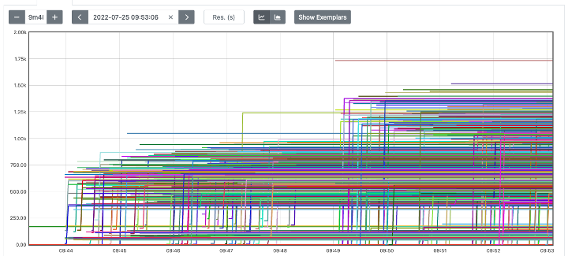

# Prometheus集成

Prometheus 是新一代的云原生监控系统，和Kubernetes有着天然的兼容关系，所以在CIS-C项目中，我们首推使用Prometheus作为监控手段实现CIS-C的性能评估。

## 服务器端搭建

Prometheus 的搭建方式有很多种，本文档中展示的是以docker方式搭建独立的prometheus服务器端。

具体搭建步骤如下：

1. 编写prometheus.yaml

   此文件为prometheus标准配置文件，详细可参考[prometheus配置文件文档](https://www.prometheus.wang/configuration/)。
   这里，我们仅配置了metrics收集，并不使用alert等配置项。

    ```
    # my global config
    global:
    scrape_interval: 5s # Set the scrape interval to every 15 seconds. Default is every 1 minute.
    evaluation_interval: 5s # Evaluate rules every 15 seconds. The default is every 1 minute.
    # scrape_timeout is set to the global default (10s).

    # Alertmanager configuration
    alerting:
    alertmanagers:
        - static_configs:
            - targets:
            # - alertmanager:9093

    # Load rules once and periodically evaluate them according to the global 'evaluation_interval'.
    rule_files:
    # - "first_rules.yml"
    # - "second_rules.yml"

    # A scrape configuration containing exactly one endpoint to scrape:
    # Here it's Prometheus itself.
    scrape_configs:
    # The job name is added as a label `job=<job_name>` to any timeseries scraped from this config.
    - job_name: "prometheus"

        # metrics_path defaults to '/metrics'
        # scheme defaults to 'http'.

        static_configs:
        - targets: ["localhost:9090"]

    - job_name: "f5-kic-1-18"
        static_configs:
        - targets: ["10.xx.yy.zz:30080"]

    ```

    我们需要按照`job_name`的方式添加需要收集metrics的target。 这里的10.xx.yy.zz:30080即为CIS-C deployment暴露的prometheus metrics监听端口。

    CIS-C deployment暴露prometheus metrics监听端口的方式如下：

    ```
    # expose the Prometheus port with NodePort
    apiVersion: v1
    kind: Service
    metadata:
    name: k8s-bigip-ctlr-c-svc
    namespace: kube-system
    spec:
    selector:
        app: k8s-bigip-ctlr-c-pod
    ports:
        - name: k8s-bigip-ctlr-c-metrics
        protocol: TCP
        port: 8080
        targetPort: 8080
        nodePort: 30080
    ```

2. 编写docker-compose.yaml 

   这里，我们将本地的prometheus.yaml 文件挂载入container中；web端口9090。

    ```
    version: "3"
    services:
    prometheus_on_k8s_master:
        image: prom/prometheus:latest
        volumes:
        - /root/prometheus/prometheus.yaml:/etc/prometheus/prometheus.yml
        ports:
        - 9090:9090
    ```


## 数据数据采集

目前CIS-C收集业务下发过程中各个关键节点的时耗数据，收集代码如下：

```
	collectors = PrometheusCollectors{
		TimeCost: prometheus.NewGaugeVec(
			prometheus.GaugeOpts{
				Name: "monitored_resource_timecost",
				Help: "time cost(in milliseconds) of monitored resources by the k8s & kic & BigIP",
			},
			[]string{"request_id", "kind", "name", "operation", "stage"},
		),
	}
```

其中各个label的含义如下：

* "request_id":
  
  当前下发请求的ID。下发请求到来后，CIS-C内部会根据操作不同，将请求拆解为不同的类型以不同的步骤执行下发，此ID可以在后续各处理步骤中标识该步骤来自哪个请求，便于累加下发总耗时。

  CIS-C会对每个k8s事件分配独立的request_id。k8s事件包括 configmap/endpoints/service/node/namespace资源的add、update、delete。

* "kind": 

  业务下发后在CIS-C内部的处理类型，包括
  * 网络处理类：arp, fdb, 
  * k8s集群资源类：configmap, endpoint, node, service, namespace
  * BIG-IP配置类：data-group, pool.members, virtualpool

* "name": 

  下发业务对应的k8s资源或BIG-IP配置名称，例如：

  * default/rest-service-http-configmap 为configmap的namespace 和name

  * kube-system/app-svc-2 为 service或者endpoint 的namespace和name

  * app_2_svc_pool 为 BIG-IP上Pool 名称

* "operation":

  业务下发的操作请求，包括
  
  * BIG-IP配置下发时的“deploy”和“delete”
  * K8s集群事件处理时的“add”，“update” 和“delete”

* "stage": 

  业务下发阶段，包括

  * “wait”：表示k8s集群事件被CIS-C接受到，在队列中的等待时间。
  * “pack”：表示从队列中取出预处理的时间，与处理过程是将k8s中的资源转化为BIG-IP可识别的数据结构。
  * “deploy”：表示CIS-C操控BIG-IP实现下发所用的时间。


## 性能测试数据及方法

将CIS-C启动后，我们就可以做性能测试了，CIS-C启动方法、参数请参考 [下载与安装](./installation.md)。

性能测试过程中，我们使用ansible 脚本**逐个**创建多个资源。

以下代码会逐个创建100个资源。

```
for n in {0..100}; do 
    ansible-playbook \
        -e src=1.standalone.complex.resources.yaml.j2 \
        -e index=$n -e count=$(($n+1)) \
        -e action=apply \
        2.0.crud-in-batch.yaml
done
```

其中

1. `2.0.crud-in-batch.yaml` 用于编排kubectl的资源yaml文件并调用kubectl创建资源。

    实现内容如下：

    ```
    ---

    - hosts: localhost
    gather_facts: false
    remote_user: root
    vars_files:
        - 0.7.test-vars.json
    tasks:
        - name: generate resource yaml
        template:
            src: '{{ src }}'
            dest: ./tmp-resources.yaml

        - name: executing {{ action }}
        shell: |
            kubectl {{ action }} -f tmp-resources.yaml
    ```

2. `1.standalone.complex.resources.yaml.j2` 为jinja2 模板文件：

    ```
    

    ---

    apiVersion: apps/v1
    kind: Deployment
    metadata:
    name: f5-vxlan-test-d{{ num }}
    namespace: default
    spec:
    replicas: 3
    selector:
        matchLabels:
        run: f5-vxlan-test-d{{ num }}
    template:
        metadata:
        labels:
            run: f5-vxlan-test-d{{ num }}
        spec:
        containers:
        - image: "nginx:latest"
            imagePullPolicy: IfNotPresent
            name: f5-vxlan-test-d{{ num }}
            ports:
            - containerPort: 80
            protocol: TCP


    ---

    apiVersion: v1
    kind: Service
    metadata:
    name: f5-vxlan-test-s{{ num }}
    namespace: default
    labels:
        cis.f5.com/as3-tenant: Tenant-{{ num }}
        cis.f5.com/as3-app: my-app
        cis.f5.com/as3-pool: mypool1
    spec:
    ports:
    - port: 80
        protocol: TCP
        targetPort: 80
    selector:
        run: f5-vxlan-test-d{{ num }}
    sessionAffinity: None
    type: ClusterIP


    ---

    apiVersion: v1
    kind: ConfigMap
    metadata:
    labels:
        f5type: virtual-server
        as3: "true"
    name: f5-vxlan-test-c{{ num }}
    namespace: default
    data:
    template: |
        {
            "class": "AS3",
            "declaration": {
                "class": "ADC",
                "schemaVersion": "3.18.0",
                "id": "urn:uuid:33045210-3ab8-4636-9b2a-c98d22ab915d",
                "label": "http",
                "remark": "application {{ num }} Template",
                "Tenant-{{ num }}": {
                    "class": "Tenant",
                    "my-app": {
                        "class": "Application",
                        "template": "generic",
                        "foo_ns_vs": {
                            "class": "Service_HTTP",
                            "remark": "app in Tenant-{{ num }}",
                            "virtualAddresses": [
                                "10.250.{{ 100 + (num/254)|int }}.{{ 1 + num%254 }}"
                            ],
                            "profileHTTP": {
                                "use": "http_X-Forwarded-For"
                            },
                            "persistenceMethods": [
                                {
                                    "use": "cookie_encryption"
                                }
                            ],
                            "iRules": [
                                "myirule"
                            ],
                            "pool": "mypool1"
                        },
                        "myirule": {
                            "class": "iRule",
                            "remark": "switch between pools",
                            "iRule": "when HTTP_REQUEST {\n if { [HTTP::uri] starts_with \"/coffee\" } {\n pool /Tenant-{{ num }}/my-app/mypool1 \n } else { \n pool /Tenant-{{ num }}/my-app/mypool2 \n } \n}"
                        },
                        "cookie_encryption": {
                            "class": "Persist",
                            "persistenceMethod": "cookie",
                            "encrypt": true,
                            "cookieMethod": "insert",
                            "passphrase": {
                                "ciphertext": "a3RjeGZ5Z2Q=",
                                "protected": "eyJhbGciOiJkaXIiLCJlbmMiOiJub25lIn0="
                            }
                        },
                        "http_X-Forwarded-For": {
                            "class": "HTTP_Profile",
                            "xForwardedFor": true
                        },
                        "mymonitor": {
                            "class": "Monitor",
                            "monitorType": "tcp",
                            "interval": 5,
                            "timeout": 16
                        },
                        "mypool1": {
                            "class": "Pool",
                            "monitors": [
                                "http"
                            ],
                            "members": [
                                {
                                    "servicePort": 80,
                                    "serverAddresses": []
                                }
                            ]
                        },
                        "mypool2": {
                            "class": "Pool",
                            "monitors": [
                                {
                                    "use": "mymonitor"
                                }
                            ],
                            "loadBalancingMode": "least-connections-member",
                            "minimumMembersActive": 0,
                            "members": [
                                {
                                    "servicePort": 80,
                                    "serverAddresses": []
                                }
                            ]
                        }
                    }
                }
            }
        }


    

    ```

## 测试数据与结果样例

测试脚本执行结束后，就可以在prometheus的UI上查看测试结果了，具体的聚合PromSQL为：

```
sum(monitored_resource_timecost{instance="10.xx.yy.zz:30080"}) by (request_id)
```

此聚合指令以`request_id`划分，将来自`10.xx.yy.zz:30080`的metrics数据加和（`sum`），计算得到各个request的时间耗时情况，如下图所示。

### 测试结果样例



图中可以看到耗时分布均在2秒以下，表示每一个k8s事件的处理时间均在2秒下。

另外，以09:48为分隔，分左右两部分，左侧为创建事件耗时统计，右侧为删除事件耗时统计。